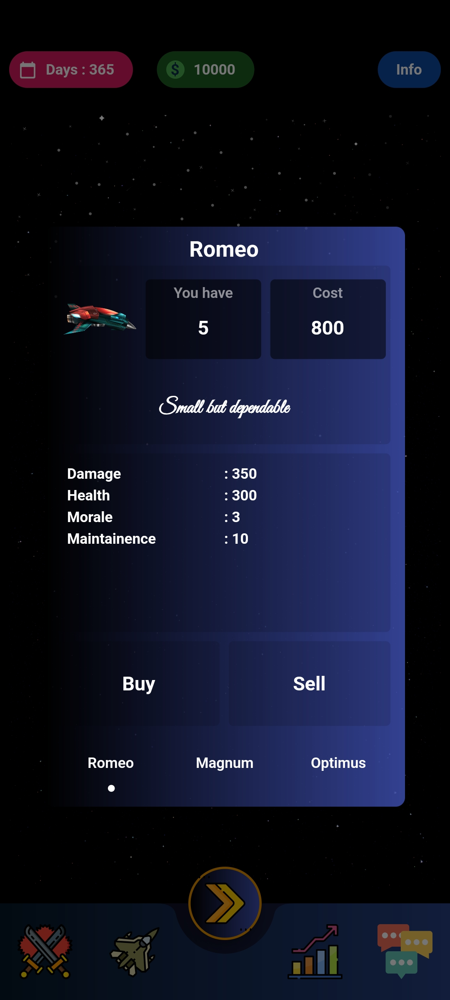
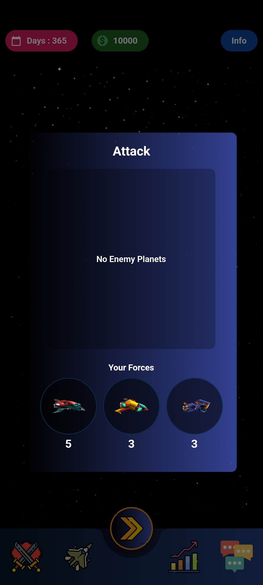
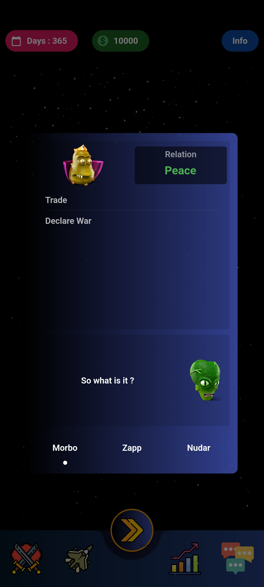
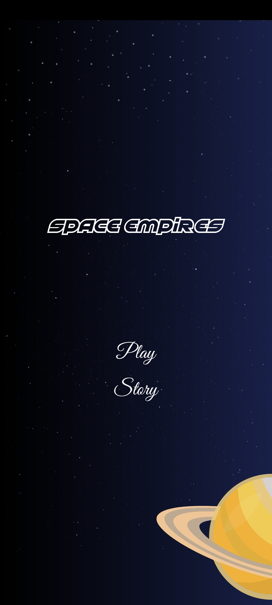
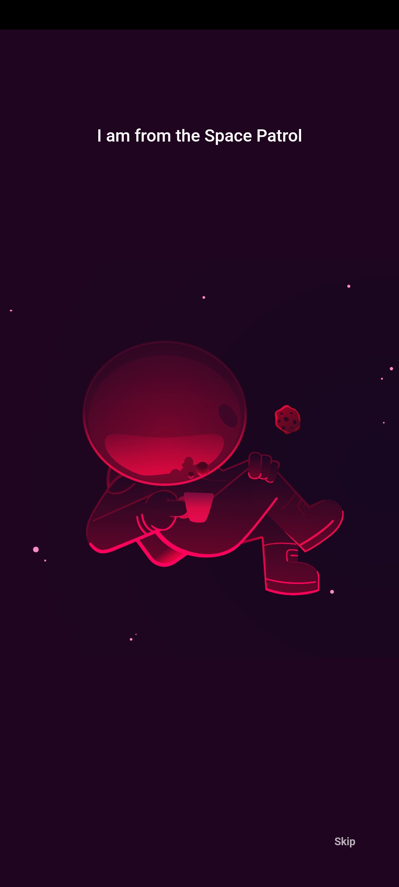

 [](https://flutter.dev/)
[](https://github.com/Solido/awesome-flutter) [](https://pub.dev/packages/lint) 

# PLANET VERSE 🛸

### Introduction 🚀

> PLANET VERSE
A 4X Space themed Strategy Game made with Flutter

## Features ⚡ 

- Cross Platform
    - Web (Tested)
    - Android (Tested)
    - IOS (Not Tested)
- Responsive (Works in both Orientations)
- Adaptive (Works Beautifully in almost all screen sizes)
- A basic custom Computer AI

## Current Progress ✔️

- All the Essential Screens/Views are done
- All the required actions for Player and Computer are defined and working
- All the Buildings/Stats/Upgrades/Ships have the desired effect
- The game follows all the defined rules
- Computer AI can take all the actions, just like a regular player
- Null-Safe and follows Lint Guidlines

## Things that need attention 🔧

- A better budget allocation strategy for computer AI
- The AI can be too aggressive sometimes
- A better chat and relations strategy for Computer AI
- A more balanced Stats allocation and reward system
- Audio Effects 
- Refactoring and Optimization
- Your health and happiness :)

Most of these can be fixed by just tweaking the constant values and numbers. (services>game.dart)
Associated TODO tags can be found over the Project, so feel free to play around with the values.
The Project will remain open-source and any contribution or feedback will be highly appreciated

### Packages 📦


These are the packages used in this Project

Package | Description
---|---
[after_layout](https://pub.dev/packages/after_layout) | Helps execute code after the first layout of a widget has been performed
[animated_text_kit](https://pub.dev/packages/animated_text_kit) | Provides Cool and Beautiful Text Animations
[carousel_slider](https://pub.dev/packages/carousel_slider) | For Slidable Cards
[flutter_animated_dialog](https://pub.dev/packages/flutter_animated_dialog) | For Animated Dialogs
[flutter_staggered_grid_view](https://pub.dev/packages/flutter_staggered_grid_view) | For Planets Alignment
[flutter_svg](https://pub.dev/packages/flutter_svg) | To render SVG
[provider](https://pub.flutter-io.cn/packages/provider) | Provider State Management
[lottie](https://pub.dev/packages/lottie) | For Lottie Animations
[sizer](https://pub.dev/packages/sizer) | Helps with Responsiveness
[rive](https://pub.dev/packages/rive) | For Rive Animations
[shared_preferences](https://pub.dev/packages/shared_preferences) | For Data Persistance
[lint](https://pub.flutter-io.cn/packages/lint) | Rules handler for Dart


### Directory Structure 🏢

The project directory structure is as follows:

```
├── android
├── asset
├── build
├── ios
├── lib
├── analysis_options.yaml
├── pubspec.lock
├── pubspec.yaml

```
Directory | Description
---|---
models | Contains Model Class for Ships, Planets, Rulers
screens | Contains the UI class for all the Screens
services | Contains the Game Service, Player Service and all Core Logic
utility | Contains app-wide constants, common functions
widgets | Contains UI Blocks and Other Functional Elements

## screen shots





